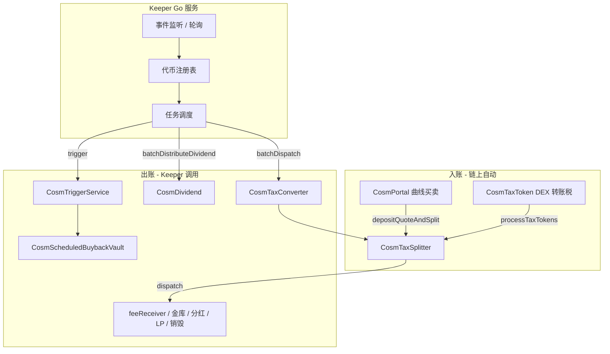

# Cosm Keeper 开发说明

> 面向 **多代币** 场景的 Go 运维 bot：监听链上事件、维护代币注册表、批量调用 `dispatch` / 分红 / Trigger 等。

---

## 1. 为什么需要 Keeper

税币 **`CosmTaxSplitter`** 采用 **入账 → dispatch 出账** 两阶段：

| 阶段 | 触发方 | 函数 | 效果 |
|------|--------|------|------|
| 入账 | Portal / TaxToken 自动 | `depositQuoteAndSplit`（曲线）· `processTaxTokens`（DEX） | 记入内部桶，**不转账** |
| 出账 | **Keeper 必须调** | `dispatch()` | 转给 feeReceiver、金库、分红、销毁、加 LP |

`dispatch()` **permissionless**（任何人可调），但 **不会自动执行**。

例外（**不需要** dispatch keeper）：

- **CosmTaxSplitterLite**（普通 V7、`lpBps=0`）：曲线费即时 `_split()`
- **CosmSplitVault**：用户自行 `claim()`

---

## 2. 系统架构



---

## 3. 部署地址（BSC mainnet）

> **2026-08-05 全量重部署** · `cosm-v0.7.0` · 旧批次（`0x59E3f460…` 等）已废弃。  
> 来自 `deployments/bsc-56.json`（升级后以链上为准）：

| 合约 | 地址 | Keeper 用途 |
|------|------|-------------|
| CosmPortal (proxy) | `0x18394A43676D8611333347b3332386bDbd59B8B4` | `getToken` 查 taxSplitter / dividend |
| CosmTaxConverter (proxy) | `0x4f5e473801cEFE63BC8657125f6942C10669a337` | 批量 dispatch / 分红 |
| CosmTriggerService (proxy) | `0xf0F5d1BDa763eb12Ff22AF8d205680541c7E6575` | 定时回购金库 callback |
| CosmVaultPortal (proxy) | `0x52F562c520F4B4Cc9390c11e61e8CFA97cB4405b` | 查金库 `tryGetVault` |
| CosmScheduledBuybackVaultFactory | `0x174D4e8B0D9eaE0c3f4ffE6A7f16E7280718F8a6` | 识别 scheduled-buyback 金库 requester |

`TriggerService.getFee()` 默认 **0.0002 BNB**（以链上为准）；`feeReceiver` 读 `Portal.feeReceiver()`（与 Trigger 初始化一致）。

---

## 4. 多代币注册表

### 4.1 数据结构（建议）

```go
type TokenJob struct {
    Token         common.Address // ERC20 税币
    TaxSplitter   common.Address // CosmTaxSplitter clone
    Dividend      common.Address // CosmDividend，0=无分红
    DividendMode  uint8          // 0=quote · 1=本币 · 2=其他 ERC20
    Converter     common.Address // dividendMode=2 时 dispatch swap 授权地址
    Vault         common.Address // 路径 B 金库，0=钱包 beneficiary
    QuoteToken    common.Address // 曲线 quote，0=BNB
    Status        uint8          // TokenStatus：1=Tradable · 4=DEX
    RequiresMEV   bool           // requiresMEVProtection()
    LastDispatch  time.Time
    PendingScore  *big.Int       // 本地估算待 dispatch 金额
}
```

### 4.2 发现新代币

**方式 A — 监听发币事件（推荐）**

监听 Portal `TokenCreated`，再用 `getToken(token)` 补全字段：

```solidity
event TokenCreated(
    uint256 ts, address creator, uint256 nonce,
    address token, string name, string symbol, string meta
);
// topic0: 0x504e7f360b2e5fe33cbaaae4c593bc55305328341bf79009e43e0e3b7f699603
// token = topics[3]  (indexed)
```

```solidity
// CosmPortal.getToken(address) → TokenState
struct TokenState {
    ...
    address taxSplitter;  // 0 = 非税币 / Lite，可跳过
    address dividend;
    ...
}
```

过滤：`tokenVersion == 6` 且 `taxSplitter != 0` 且 implementation 为 **CosmTaxSplitter**（非 Lite）。

Lite 识别：`feeConfig().marketBps + deflationBps + dividendBps + lpBps` 四路和为 mkt+lp 简单拆分，或链上 `depositQuoteAndSplit` 后立即出账 — **无需进 dispatch 队列**。

**方式 B — 历史回填**

从部署块高扫描全部 `TokenCreated`，批量 `getToken`。

**方式 C — 入账事件反查**

监听到某 `taxToken` 的 `BondingCurveTax` / `ProcessTaxTokens` 时，若注册表没有则 `getToken` 补登记。

### 4.3 迁移状态更新

监听 `TokenProgressChanged` 或轮询 `getTokenV8Safe(token).status`：

- `status == 4`（DEX）→ `feeRate` 已在 migrate 时改为 **4100**（41%）
- DEX 后 tax 走 `processTaxTokens`，仍要 keeper `dispatch`

---

## 5. Keeper 任务一览

| 任务 ID | 优先级 | 调用目标 | 权限 | 说明 |
|---------|--------|----------|------|------|
| `dispatch` | 高 | `TaxSplitter.dispatch()` 或 Converter 批量 | 无 / `DISPATCHER_ROLE` | 税币四路出账 |
| `dispatch_mev` | 高 | `Converter.batchDispatch` | `DISPATCHER_ROLE` | dividendMode=2 且需 MEV 保护 |
| `distribute_dividend` | 中 | `Converter.batchDistributeDividend` | 无 | 批量结算持币者 pending |
| `trigger_buyback` | 中 | `TriggerService.trigger` / `triggerMultiple` | `TRIGGER_ROLE` | 定时回购金库 |
| `case3_convert` | 低 | `TaxSplitter.dispatch()` **且 msg.sender=converter** | converter 私钥 | mode=2 分红 swap |
| `v4_notify` | 低 | `TaxSplitter.checkAndNotifyDispatch` | 无 | 仅 Infinity V4 待收 LP 费信号 |

---

## 6. Dispatch 核心逻辑

### 6.1 何时该 dispatch

对每个 `TaxSplitter` 读以下 **public 桶**（任一 > 阈值即应 dispatch）：

```solidity
feeQuoteBalance
marketQuoteBalance
lpQuoteBalance
commissionQuoteBalance
preBondBurnFunds              // 待销毁回购
pendingDividendQuoteTokenBalance
dividendTokenBalance
deferredTaxTokenBalance       // 待 process 的 tax token
```

辅助 view：

```solidity
minBuyBackQuote()             // 过小可能 dispatch 内 swap 跳过
dispatchThreshold()           // V4 LP 费信号阈值（Infinity 普通币）
requiresMEVProtection()       // true → 禁止走 permissionless 批量
dividendMode()                // 2 = Case3
converter()                   // Case3 swap 调用者地址
```

**推荐策略**

1. **事件驱动**：见 §7，`BondingCurveTax` / `ProcessTaxTokens` 到达 → 延迟 N 秒合并 dispatch（防抖，如 30–120s）
2. **定时轮询**：每 1–5 分钟扫注册表，`sum(buckets) >= MinDispatchQuote`（配置，如 0.01 BNB 等值）
3. **失败重试**：`dispatch` revert 时指数退避；常见原因：池子流动性不足、gas 不够、迁移未完成

### 6.2 调用方式

**单代币**

```solidity
ICosmTaxProcessor(taxSplitter).dispatch();
// selector: 0xe9c4a3ac
// gas 建议: 3_000_000（与 Converter 内部上限一致）
```

**多代币批量（推荐）**

```solidity
// 需 DISPATCHER_ROLE（运营钱包）
CosmTaxConverter.batchDispatch(address[] taxProcessors);
// selector: 0x7fedff4e

// 公开；跳过 requiresMEVProtection==true 的 processor
CosmTaxConverter.batchDispatchPermissionless(address[] taxProcessors);
// selector: 0x608359b6
```

**MEV 分流**

```go
var normal, mev []common.Address
for _, job := range registry.All() {
    if job.RequiresMEV {
        mev = append(mev, job.TaxSplitter)
    } else {
        normal = append(normal, job.TaxSplitter)
    }
}
// normal → batchDispatchPermissionless(normal)
// mev    → batchDispatch(mev)  // 需 DISPATCHER_ROLE，可走私有 RPC / Flashbots
```

`requiresMEVProtection()` 条件（链上）：

```solidity
dividendMode == 2 && dividendBps > 0 && converter != address(0)
```

首次批量前可对每个 processor 调：

```solidity
Converter.checkAndCacheMEVProtection(taxProcessor)
```

### 6.3 dispatch 成功后链上效果

监听成功事件：

```solidity
event DispatchExecuted(
    address indexed taxToken, uint256 feeAmount, uint256 marketAmount, uint256 dividendAmount
);
// topic0: 0x00f5666a9426f536cc33e459e6d9f34c20cc1079e627d60481c3bb9ea94c0049

// Flap 别名（同参数）
event FlapTaxProcessorDispatchExecuted(...);
// topic0: 0x172485312163eefa9f05b438339dc7c596fbb24af0cb3e35b9130c68453a0d88
```

子事件（审计用）：`FeePaid` · `WalletDistributed` · `BurnExecuted` · `FlapTaxProcessorDividendConverted`

---

## 7. 监听事件清单

### 7.1 触发 dispatch 调度

| 事件 | topic0 | indexed | 说明 |
|------|--------|---------|------|
| `BondingCurveTax(address,uint256)` | `0x605e8297...` | taxToken | 曲线 tax 入账 |
| `FlapTaxProcessorBondingCurveTax(address,uint256)` | `0xe28939e2...` | taxToken | 同上 Flap 名 |
| `ProcessTaxTokens(address,uint256)` | `0x2b93f18f...` | taxToken | DEX tax 已 process |
| `FlapTaxProcessorProcessTaxTokens(address,uint256)` | `0x378102bd...` | taxToken | 同上 |
| `TokensParked(address,uint256)` | — | taxToken | swap 重入暂存，需后续 dispatch |
| `TaxLiquidationError` (TaxToken) | — | — | 清算失败，tax 已转 Splitter，**应 dispatch** |

### 7.2 注册表 / 生命周期

| 事件 | topic0 | 说明 |
|------|--------|------|
| `TokenCreated(...)` | `0x504e7f36...` | 新代币，补 `getToken` |
| `TokenProgressChanged(address,uint256)` | `0xbefe9b7d...` | 迁移进度；progress=1e18 时可关注 migrate |
| `FeeRateUpdated(uint16,uint16)` | — | migrate 后 6000→4100 |

### 7.3 V4 LP 费信号（普通 Infinity 币）

| 事件 | topic0 | 说明 |
|------|--------|------|
| `CosmDispatchReady(...)` | `0x50673b85...` | 待收 LP 费 ≥ threshold |
| `FlapDispatchReady(...)` | `0xcfe55ad5...` | 同上 |

Keeper 可先调 `checkAndNotifyDispatch()`（selector `0x52ddd8a5`），再 `dispatch()`。

### 7.4 Converter 批量结果

| 事件 | 说明 |
|------|------|
| `CosmDispatchCalled(taxProcessor, success)` | 单笔 batch 成败 |
| `CosmBatchOperationCalled(caller, operationType)` | 0=BatchDispatch · 3=Permissionless |

### 7.5 分红

| 事件 | 说明 |
|------|------|
| `FlapDividendDeposited(taxToken, amount, ...)` | dispatch 打入分红 |
| `FlapDividendDistributed(taxToken, user, amount)` | 用户已结算 |

---

## 8. 分红 Keeper（可选）

`dispatch` 把 quote/代币打入 `CosmDividend` 后，持币者 **`pendingBalance` 仍要结算**：

```solidity
CosmTaxConverter.batchDistributeDividend(
    address[] dividends,
    address[][] usersList   // 每个 dividend 对应一批用户
);
// selector: 0x84da2c7b
```

**用户列表来源**

- 监听 `Transfer`（tax token）维护 holder 集合（排除 pool / dead / splitter）
- 或监听 `FlapDividendShareChanged`
- 轮询：`withdrawableDividendOf(user) > 0` 的用户分批传入（每批建议 ≤ 50–100）

单用户也可链上自行 `withdrawDividends()`，keeper 只是 **批量代结算** UX 优化。

---

## 9. Trigger Keeper（定时回购金库）

`CosmScheduledBuybackVault` 通过 **CosmTriggerService** 回调：

```solidity
// 需 TRIGGER_ROLE
TriggerService.trigger(uint256 requestId);           // 0xed684cc6
TriggerService.triggerMultiple(uint256[] requestIds); // 0xc39b4b6b
```

**ROLE**

```text
TRIGGER_ROLE = 0xc8380a9ed3810df5e9faa1cdd29581f1ee3bb82654546cebc42c97aaa1ee54d1
DISPATCHER_ROLE = 0xfbd38eecf51668fdbc772b204dc63dd28c3a3cf32e3025f52a80aa807359f50c
```

**发现待执行请求**

- 监听 `CosmTriggerRequested(requestId, requester, executeAfter, feePaid)`
- 轮询：`getRequestCount()` + `isRequestReady(id)`
- 金库 view：`ScheduledBuybackVault.getStatus().ready == true` 且 `pendingRequestId != 0`

---

## 10. Case3 分红（dividendMode = 2）

dispatch 内 quote → `dividendRewardToken` swap **仅 `converter` 地址作为 msg.sender 时** 在 dispatch 路径中执行。

Keeper 需部署 **converter 热钱包**（与 Portal 发币时 `TaxAllocation.converter` 一致）：

1. 确认 `pendingDividendQuoteTokenBalance >= minBuyBackQuote`
2. 用 **converter 私钥** 调 `TaxSplitter.dispatch()`（或通过 Converter `triggerSplit`）

`requiresMEVProtection()==true` 的 token **必须** 用私有路由 dispatch，避免 sandwich。

---

## 11. Go 项目建议结构

```text
cosm-keeper/
├── cmd/keeper/main.go          # 入口
├── config/
│   └── config.yaml             # RPC、合约地址、轮询间隔、MinDispatchQuote
├── internal/
│   ├── registry/               # 代币注册表（Postgres / Redis / 内存+快照）
│   ├── watcher/                # 事件订阅 + 历史扫描
│   ├── scheduler/              # dispatch / dividend / trigger 队列
│   ├── executor/               # 发 tx、nonce 管理、gas 策略
│   └── bindings/               # abigen 生成
├── abigen.sh                   # 从 artifacts 生成 Go binding
└── Dockerfile
```

### 11.1 依赖

```bash
go get github.com/ethereum/go-ethereum
```

### 11.2 生成 Binding

```bash
# 示例：Portal + Converter + TaxSplitter + TriggerService
abigen --abi artifacts/CosmPortal.json --pkg portal --type Portal --out bindings/portal.go
abigen --abi artifacts/CosmTaxConverter.json --pkg converter --type Converter --out bindings/converter.go
abigen --abi artifacts/CosmTaxSplitter.json --pkg splitter --type TaxSplitter --out bindings/splitter.go
abigen --abi artifacts/CosmTriggerService.json --pkg trigger --type TriggerService --out bindings/trigger.go
```

### 11.3 主循环伪代码

```go
func main() {
    client, _ := ethclient.Dial(cfg.RPC)
    portal, _ := portal.NewPortal(cfg.Portal, client)
    converter, _ := converter.NewConverter(cfg.Converter, client)

    reg := registry.New()
    go watcher.Run(ctx, client, portal, reg)      // TokenCreated + tax 入账事件

    ticker := time.NewTicker(cfg.PollInterval)
    for {
        select {
        case <-ticker.C:
            runDispatchBatch(ctx, client, converter, reg)
            runDividendBatch(ctx, converter, reg)
            runTriggerBatch(ctx, client, reg)
        case job := <-reg.DispatchQueue:
            scheduleDispatch(job, cfg.Debounce)
        }
    }
}

func runDispatchBatch(ctx context.Context, client *ethclient.Client, c *converter.Converter, reg *registry.Registry) {
    var normal, mev []common.Address
    for _, t := range reg.TokensNeedDispatch(cfg.MinDispatchQuote) {
        split, _ := splitter.NewTaxSplitter(t.TaxSplitter, client)
        mevProtected, _ := split.RequiresMEVProtection(nil)
        if mevProtected {
            mev = append(mev, t.TaxSplitter)
        } else {
            normal = append(normal, t.TaxSplitter)
        }
    }
    if len(normal) > 0 {
        auth := bindOpts(cfg.PermissionlessKey) // 无私钥也可，任意 EOA
        c.BatchDispatchPermissionless(auth, normal)
    }
    if len(mev) > 0 {
        auth := bindOpts(cfg.DispatcherKey) // 需 DISPATCHER_ROLE
        c.BatchDispatch(auth, mev)
    }
}
```

### 11.4 注册新代币

```go
func onTokenCreated(ctx context.Context, portal *portal.Portal, token common.Address, reg *registry.Registry) error {
    st, err := portal.GetToken(nil, token)
    if err != nil || st.TaxSplitter == (common.Address{}) {
        return nil // 非税币或 Lite
    }
    split, _ := splitter.NewTaxSplitter(st.TaxSplitter, client)
    mode, _ := split.DividendMode(nil)
    conv, _ := split.Converter(nil)
    mev, _ := split.RequiresMEVProtection(nil)

    reg.Upsert(&TokenJob{
        Token: token, TaxSplitter: st.TaxSplitter, Dividend: st.Dividend,
        DividendMode: mode, Converter: conv, Vault: st.Vault,
        QuoteToken: st.QuoteToken, RequiresMEV: mev,
    })
    return nil
}
```

### 11.5 待 dispatch 判断

```go
func (t *TokenJob) RefreshPending(ctx context.Context, split *splitter.TaxSplitter) (*big.Int, error) {
    buckets := []*big.Int{
        must(split.FeeQuoteBalance(nil)),
        must(split.MarketQuoteBalance(nil)),
        must(split.LpQuoteBalance(nil)),
        must(split.CommissionQuoteBalance(nil)),
        must(split.PreBondBurnFunds(nil)),
        must(split.PendingDividendQuoteTokenBalance(nil)),
        must(split.DividendTokenBalance(nil)),
    }
    sum := big.NewInt(0)
    for _, b := range buckets {
        sum.Add(sum, b)
    }
    // deferredTaxTokenBalance > 0 也应 dispatch（会先 process 再 payout）
    def, _ := split.DeferredTaxTokenBalance(nil)
    if def.Sign() > 0 {
        sum.Add(sum, def) // 粗略；实际以 quote 计需链下 quote 估价
    }
    return sum, nil
}
```

---

## 12. 配置项参考

```yaml
chain_id: 56
rpc_url: "https://bsc-dataseed.binance.org"
portal: "0x18394A43676D8611333347b3332386bDbd59B8B4"
converter: "0x4f5e473801cEFE63BC8657125f6942C10669a337"
trigger_service: "0xf0F5d1BDa763eb12Ff22AF8d205680541c7E6575"
vault_portal: "0x52F562c520F4B4Cc9390c11e61e8CFA97cB4405b"
scheduled_buyback_factory: "0x174D4e8B0D9eaE0c3f4ffE6A7f16E7280718F8a6"

# 私钥：dispatcher 需 Converter DISPATCHER_ROLE；trigger 需 TRIGGER_ROLE
# permissionless 可用任意有 gas 的 EOA 调 batchDispatchPermissionless
dispatcher_private_key: "..."
trigger_private_key: "..."
converter_private_key: "..."   # Case3 dividendMode=2 专用

poll_interval: 2m
dispatch_debounce: 60s
min_dispatch_quote_wei: "10000000000000000"   # 0.01 BNB 等值（需按 quote 折算）
max_batch_size: 20
tx_gas_limit: 3000000
confirmations: 1

# 从哪块开始扫历史 TokenCreated
start_block: 0
```

---

## 13. 运维与监控

| 指标 | 说明 |
|------|------|
| `pending_dispatch_total` | 所有 token 桶余额之和 |
| `dispatch_success_rate` | `CosmDispatchCalled(success=true)` 比例 |
| `dispatch_latency` | 入账事件 → DispatchExecuted 延迟 |
| `registry_token_count` | 注册税币数量 |
| `trigger_ready_count` | `isRequestReady==true` 请求数 |

**告警条件**

- 某 token `deferredTaxTokenBalance` 长期 > 0
- 连续 N 次 `dispatch` revert
- `TokensParked` 后超过 M 分钟无 `DispatchExecuted`

---

## 14. 与 Flap 对齐要点

| 项 | 值 |
|----|-----|
| 发币 `feeRate` | 6000（60%） |
| 迁移后 `feeRate` | 4100（41%），migrate 时 Portal 自动 `setFeeRate` |
| 批量入口 | `CosmTaxConverter`（Flap 同款 ABI） |
| 事件 | 同时发 `Flap*` 与 `Cosm*` 别名，订阅其一即可 |

---

## 15. 快速检查清单

- [ ] Keeper 钱包已授予 `DISPATCHER_ROLE`（Converter）· `TRIGGER_ROLE`（TriggerService）
- [ ] 注册表监听 `TokenCreated` + 历史回填
- [ ] 监听 `BondingCurveTax` / `ProcessTaxTokens` 触发 debounced dispatch
- [ ] `requiresMEVProtection` 代币走 `batchDispatch`，其余走 permissionless
- [ ] dividendMode=2 配置 converter 私钥
- [ ] 可选：`batchDistributeDividend` + Trigger 定时回购
- [ ] Gas / nonce / 失败重试 / Prometheus 指标

---

## 16. 相关源码

| 文件 | 内容 |
|------|------|
| `contracts/tax/CosmTaxSplitter.sol` | `dispatch()` · view 桶 |
| `contracts/tax/CosmTaxSplitterDispatch.sol` | dispatch 内部逻辑 |
| `contracts/tax/CosmTaxConverter.sol` | 批量 dispatch / 分红 |
| `contracts/CosmTriggerService.sol` | 定时 callback |
| `contracts/portal/CosmPortal.sol` | `getToken` |
| `deployments/bsc-56.json` | 主网地址 |

---

## 17. 入门：先通过 token 找到什么？

Keeper 的入口是 **税币合约地址 `token`**。不需要事先记住每个项目的 `taxSplitter` 克隆地址；只要知道 `token`（或从发币事件拿到），就能在链上查全后续要调的合约。

### 17.1 一句话

```
token 地址  →  Portal.getToken(token)  →  taxSplitter / dividend / vault / quote …
                                              ↓
                                    Keeper 对 taxSplitter 调 dispatch()
```

### 17.2 五步流程

```text
① 知道 token（发币事件 / 历史扫描 / 入账事件）
        ↓
② portal.getToken(token)
        ↓ 得到
   taxSplitter、dividend、vault、quote、status …
        ↓
③ 读 taxSplitter 各 bucket，或听 BondingCurveTax / ProcessTaxTokens
        ↓ 有 pending
④ taxSplitter.dispatch()  （或 Converter 批量）
        ↓
⑤ 钱到 feeReceiver / 金库 / 分红 / LP / 销毁
```

**「先通过 token 找到」= 第 ② 步**：`getToken(token)` 找到 `taxSplitter`（以及 `dividend` 等）。日常循环就是：**token → getToken → taxSplitter → 要不要 dispatch → 调 dispatch**。

### 17.3 第 ① 步：怎么拿到 token 列表？

注册表主键是 **税币 ERC20 地址**。常见来源：

| 方式 | 怎么做 |
|------|--------|
| 监听发币 | Portal `TokenCreated`，`token = topics[3]` |
| 历史扫描 | 从部署块起扫全部 `TokenCreated` |
| 被动发现 | 听到 `BondingCurveTax` / `ProcessTaxTokens`，事件里 `taxToken` 即 token |

### 17.4 第 ② 步：Portal.getToken(token)

```solidity
CosmTypes.TokenState memory st = portal.getToken(token);
```

Keeper 相关字段：

| 字段 | 含义 | Keeper 是否关心 |
|------|------|----------------|
| `st.taxSplitter` | 税处理器 clone | **是** — dispatch 调它 |
| `st.dividend` | 分红合约 | 有则可能需要 `batchDistributeDividend` |
| `st.beneficiary` / `st.vault` | 营销钱包或金库 | dispatch 后到账，一般无需再调 |
| `st.quoteToken` | 曲线 quote | 估算 pending、展示 |
| `st.status` | 1=曲线 · 4=DEX | 判断阶段 |
| `st.tokenVersion` | 6=税币 · 7=普通 | 6 且 taxSplitter≠0 才进队列 |

**进 Keeper 队列条件：**

```text
tokenVersion == 6  &&  taxSplitter != 0  &&  不是 TaxSplitterLite
```

- `taxSplitter == 0` → 跳过  
- **TaxSplitterLite**（普通 V7、无 LP）→ 曲线费即时 split，**不需要 dispatch keeper**

### 17.5 第 ③ 步：用 taxSplitter 判断有没有活

`token` 负责 **定位**；干活对象是 **`st.taxSplitter`**。

读 pending 桶（任一 > 0 应考虑 dispatch）：

```text
feeQuoteBalance
marketQuoteBalance
lpQuoteBalance
preBondBurnFunds
pendingDividendQuoteTokenBalance
dividendTokenBalance
deferredTaxTokenBalance
```

或监听入账事件（只记账、不转账，钱仍在 Splitter）：

```text
BondingCurveTax(taxToken, ...)     ← 曲线买卖 tax 入账
ProcessTaxTokens(taxToken, ...)    ← DEX tax 已 process
```

### 17.6 第 ④ 步：执行 dispatch

```solidity
ICosmTaxProcessor(st.taxSplitter).dispatch();
```

或多币：

```solidity
converter.batchDispatch([splitter1, splitter2, ...]);
```

### 17.7 第 ⑤ 步：确认出账

```text
DispatchExecuted(taxToken, feeAmount, marketAmount, dividendAmount)
```

事件里的 `taxToken` 就是第 ① 步的 `token`。

### 17.8 与 TaxToken 的交叉验证

```solidity
CosmTaxToken(token).taxProcessor()  // 应等于 getToken(token).taxSplitter
```

DEX 阶段 **TaxToken 自动**调 `processTaxTokens()`（Keeper 不参与）；Keeper 只负责之后的 **`dispatch()`**。

### 17.9 完整小例子

1. `TokenCreated` → `token = 0xABC…`
2. `getToken(0xABC)` → `taxSplitter = 0xDEF…`，`dividend = 0x123…`
3. 用户买卖 → `BondingCurveTax(0xABC, 1e17)`
4. 读 `0xDEF.marketQuoteBalance()` > 0
5. Keeper 对 `0xDEF` 调 `dispatch()`
6. `DispatchExecuted(0xABC, …)` → 金库 / feeReceiver 等到账

