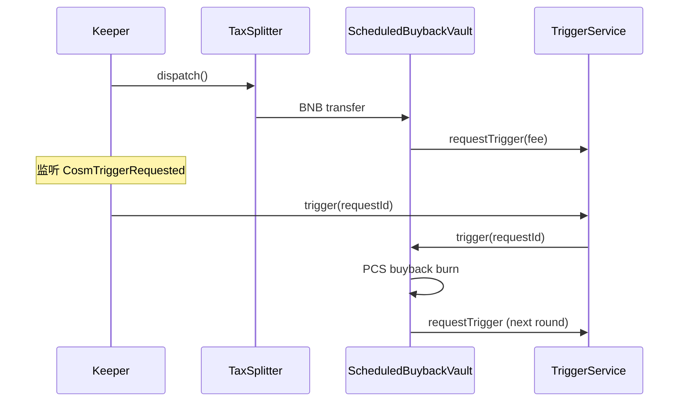

# Cosm Keeper 开发说明

> 面向 **多代币** 场景的 Go 运维 bot：监听链上事件、维护代币注册表、批量调用 `dispatch` / 分红 / Trigger 等。

---

## 1. 为什么需要 Keeper

税币 **`CosmTaxSplitter`** 采用 **入账 → dispatch 出账** 两阶段：

| 阶段 | 触发方 | 函数 | 效果 |
|------|--------|------|------|
| 入账 | Portal / TaxToken 自动 | `depositQuoteAndSplit`（曲线）· `processTaxTokens`（DEX） | 记入内部桶，**不转账** |
| 出账 | **Keeper 必须调** | `dispatch()` | 转给 feeReceiver、金库、分红、销毁（LP 在 DEX `processTaxTokens` 配对，不在 dispatch） |

`dispatch()` **permissionless**（任何人可调），但 **不会自动执行**。

例外（**不需要** dispatch keeper）：

- **CosmTaxSplitterLite**（普通 V7、`lpBps=0`）：曲线费即时 `_split()`
- **CosmSplitVault**：用户自行 `claim()`

---

## 2. 系统架构


---

## 3. 部署地址（BSC mainnet）

> **2026-08-09 全量重部署** · `cosm-v0.8.0` · 含税侧 Flap 对齐（直连 quote↔token / Portal 回购 / dispatch 不花 `lpQuoteBalance`）。  
> 旧批次（`0x19a165…` Portal / `0xF390c9…` Converter / `0x477484…` Trigger / `0x163292…` Scheduled 工厂等）已废弃。  
> **地址真源**：`deployments/bsc-56.json`（proxy / 核心 impl / 6 个 factory proxy）。  
> **Trigger `requestId` 从 1 起**；`pendingRequestId==0` 仍表示金库无 pending。  
> Vault **工厂**为 Transparent proxy；金库实例为 BeaconProxy（`trigger` / `getStatus` 等方法名不变）。  
> 工厂 `factorySpecVersion()` = `"v2.3"`（校验用）。  
> ABI 可开源仓 / BSCScan verified 自行拉取；改 pin 时除 proxy 外还需核对下表 **implementation / Beacon**。

### 3.1 核心入口（proxy + implementation）

| 合约 | Proxy | Implementation | Keeper 用途 |
|------|-------|----------------|-------------|
| CosmPortal | `0xF2846c87e039A4b9147fb8BED3311bdCC4d540a4` | `0xA3e208B2f71D2FBE4E26ebAf35cFc272123508ec` | `getToken` 查 taxSplitter / dividend |
| CosmVaultPortal | `0x3F7730f9A423f415bCCA6319F17c623123D0f54B` | `0x16547EB890E68098efACB16378Ccc37FE5773c03` | 查金库 `tryGetVault` |
| CosmTriggerService | `0x8F7dBa5a2FaC6876f1A6EF2B4C7b640FA370a843` | `0x8b7854A752Fc59EB5d2d7777B8D6c338Ccfe92Ce` | 定时回购金库 callback |
| CosmTaxConverter | `0x19bfc979cC70676C7028085B540c02f2CFb5f061` | `0x8a84Eb93Bf83a9Ca5BA2D00A45eECC287dEE3394` | 批量 dispatch / 分红 |

JSON 字段：`portalProxy` / `portalImpl` · `vaultProxy` / `vaultImpl` · `triggerProxy` / `triggerImpl` · `converterProxy` / `converterImpl`。

### 3.2 官方 Vault factories（6 套 pin）

识别金库玩法、校验 factory / Beacon / vault impl 时用。  
`factoryProxy` 在 `bsc-56.json`；`factoryImpl` / `vaultBeacon` / `vaultImplementation` 由链上读取（EIP-1967 impl slot · `vaultBeacon()` · `vaultImplementation()`），部署脚本当前未写入 JSON。

| `vaultType` | factoryProxy | factoryImpl | vaultBeacon | vaultImplementation |
|-------------|--------------|-------------|-------------|---------------------|
| `split` | `0x7D41fc6Af8135BAf07283bB5620e12a8D18BfFD4` | `0x9FeBf5b879360bfAe9Cad89Dd33A9838CbdA2726` | `0x8Fa5E1653eD4A9D4bDb4Aa07fbe7142DB85ef4f2` | `0x9B9160E4DD5C937D6d7A3CAF38994Ae317fEaCe4` |
| `scheduled-buyback` | `0xb4aecB8f71e971D2823F405b08cF71b00ECF1C3F` | `0xB922E259DdB44B8E722c9B96fAA61B862b44E3D8` | `0xfA2f089acbD023c37764b3176d79a675336f7546` | `0x60184215a8f9E676BbccaeD61171163ECBd10665` |
| `burn-dividend` | `0x8CB8f70E354FAA389Cd68f542B3a5E370F68Fa2B` | `0x29c492753EF4D085A80DDFeA3cDa3d4dbaD3cc0D` | `0x1802F9D716B5207c89cA7D618A69568952FaA535` | `0x1D44866F0F4007FBF62A8192B4EB7323265c5836` |
| `lp-staking-dividend` | `0xF317669B8Fb1D6ec6849e93822F4a8C7b051D5bf` | `0xcbeEA74EbcB867A90a16b8299058816BdFF5201d` | `0x75F041A7b78C35Acb0203828787ED267cFd79390` | `0x4f499e570080B5791D1129536A3a0118E5Cda0d3` |
| `token-staking-dividend` | `0xb3c3aDdf35D92250a4c4f4fb6153Bc85Ab94fcf2` | `0x1881B5F344Ce6E9089E8e02807a532EFA48048B7` | `0xA2D745BDD93f34fcb6622E206F0D2FC1284320Eb` | `0xEa3c7048b1DE303F708E31F736CE5DDd06617F62` |
| `rank-burn-dividend` | `0x25bf46f6Beab3fC546EC0a1Bcfbf32367e4EC3f4` | `0x33BBF435f7f7fE54d8A5dbF7202A958cA6Ac5Cd0` | `0xE2Cf0BF12158DB8382cEd21ED740fC6a79CF245f` | `0x13B401f4d43721Bf9C34D5649A991a63558af510` |

JSON 字段对照：`splitFactory` · `scheduledFactory` · `burnDivFactory` · `lpStakeFactory` · `tokenStakeFactory` · `rankBurnFactory`。

`TriggerService.getFee()` 默认 **0.0002 BNB**（以链上为准）；`feeReceiver` 读 `Portal.feeReceiver()`（与 Trigger 初始化一致）。

### 3.3 交给后端改 pin 时

| 交付物 | 用途 |
|--------|------|
| 本文 §3 | 行为入口 + 全套 pin（含 Converter impl 与 6 factory 三元组） |
| `deployments/bsc-56.json` | 机器可读真源（proxy / 核心 impl / factory proxy） |
| ABI | 开源 / 链上 verified 自行 copy，不必随文档打包 |

---

## 4. 多代币注册表

### 4.1 数据结构（建议）

```go
type TokenJob struct {
    Token         common.Address // ERC20 税币
    TaxSplitter   common.Address // CosmTaxSplitter clone
    Dividend      common.Address // CosmDividend，0=无分红
    DividendMode  uint8          // 0=quote · 1=本币 · 2=其他 ERC20
    Converter     common.Address // dividendMode=2 时 dispatch swap 授权地址
    Vault         common.Address // 路径 B 金库，0=钱包 beneficiary
    VaultType     string         // 金库玩法："" · split · scheduled-buyback · burn-dividend · rank-burn-dividend · …
    QuoteToken    common.Address // 曲线 quote，0=BNB
    Status        uint8          // TokenStatus：1=Tradable · 4=DEX
    RequiresMEV   bool           // requiresMEVProtection()
    LastDispatch  time.Time
    PendingScore  *big.Int       // 本地估算待 dispatch 金额
}
```

### 4.2 发现新代币

**方式 A — 监听发币事件（推荐）**

监听 Portal `TokenCreated`，再用 `getToken(token)` 补全字段：

```solidity
event TokenCreated(
    uint256 ts, address creator, uint256 nonce,
    address token, string name, string symbol, string meta
);
// topic0: 0x504e7f360b2e5fe33cbaaae4c593bc55305328341bf79009e43e0e3b7f699603
// token = topics[3]  (indexed)
```

```solidity
// CosmPortal.getToken(address) → TokenState
struct TokenState {
    ...
    address taxSplitter;  // 0 = 非税币 / Lite，可跳过
    address dividend;
    ...
}
```

过滤：`tokenVersion == 6` 且 `taxSplitter != 0` 且 implementation 为 **CosmTaxSplitter**（非 Lite）。

Lite 识别：`feeConfig().marketBps + deflationBps + dividendBps + lpBps` 四路和为 mkt+lp 简单拆分，或链上 `depositQuoteAndSplit` 后立即出账 — **无需进 dispatch 队列**。

**方式 B — 历史回填**

从部署块高扫描全部 `TokenCreated`，批量 `getToken`。

**方式 C — 入账事件反查**

监听到某 `taxToken` 的 `BondingCurveTax` / `ProcessTaxTokens` 时，若注册表没有则 `getToken` 补登记。

### 4.3 迁移状态更新

监听 `TokenProgressChanged` 或轮询 `getTokenV8Safe(token).status`：

- `status == 4`（DEX）→ `feeRate` 仍为 **1000**（migrate 时 `setFeeRate(1000)`，与 curve 相同）
- DEX 后 tax 走 `processTaxTokens`，仍要 keeper `dispatch`

---

## 5. Keeper 任务一览

| 任务 ID | 优先级 | 调用目标 | 权限 | 说明 |
|---------|--------|----------|------|------|
| `dispatch` | 高 | `TaxSplitter.dispatch()` 或 Converter 批量 | 无 / `DISPATCHER_ROLE` | 税币四路出账 |
| `dispatch_mev` | 高 | `Converter.batchDispatch` | `DISPATCHER_ROLE` | dividendMode=2 且需 MEV 保护 |
| `trigger_split` | 中 | `Converter.triggerSplit(taxTokens)` | 无（MEV 币须 role） | 内部 `triggerSingleSplit`；**EOA 勿直调** `triggerSingleSplit` |
| `distribute_dividend` | 中 | `Converter.batchDistributeDividend` | 无 | 批量结算持币者 pending |
| `trigger_buyback` | 中 | `TriggerService.trigger` / `triggerMultiple` | `TRIGGER_ROLE` | 定时回购金库 |
| `case3_convert` | 低 | `TaxSplitter.dispatch()` **且 msg.sender=converter** | converter 私钥 | mode=2 分红 swap |
| `v4_notify` | 低 | `TaxSplitter.checkAndNotifyDispatch` | 无 | 仅 Infinity V4 待收 LP 费信号 |

---

## 6. Dispatch 核心逻辑

### 6.1 何时该 dispatch

对每个 `TaxSplitter` 读以下 **public 桶**（任一 > 阈值即应 dispatch）：

```solidity
feeQuoteBalance
marketQuoteBalance
commissionQuoteBalance
preBondBurnFunds              // 待销毁回购
pendingDividendQuoteTokenBalance
dividendTokenBalance
deferredTaxTokenBalance       // 待 process 的 tax token
// lpQuoteBalance — 勿单独当作「该 dispatch」：dispatch 不清此桶（Flap：DEX processTaxTokens 配对花费）
```

辅助 view：

```solidity
minBuyBackQuote()             // 过小可能 dispatch 内 swap 跳过
dispatchThreshold()           // V4 LP 费信号阈值（Infinity 普通币）
requiresMEVProtection()       // true → 禁止走 permissionless 批量
dividendMode()                // 2 = Case3
converter()                   // Case3 swap 调用者地址
```

**推荐策略**

1. **事件驱动**：见 §7，`BondingCurveTax` / `ProcessTaxTokens` 到达 → 延迟 N 秒合并 dispatch（防抖，如 30–120s）
2. **定时轮询**：每 1–5 分钟扫注册表，`sum(buckets) >= MinDispatchQuote`（配置，如 0.01 BNB 等值）
3. **失败重试**：`dispatch` revert 时指数退避；常见原因：池子流动性不足、gas 不够、迁移未完成

### 6.2 调用方式

**单代币**

```solidity
ICosmTaxProcessor(taxSplitter).dispatch();
// selector: 0xe9c4a3ac
// gas 建议: 3_000_000（与 Converter 内部上限一致）
```

**多代币批量（推荐）**

```solidity
// 需 DISPATCHER_ROLE（运营钱包）
CosmTaxConverter.batchDispatch(address[] taxProcessors);
// selector: 0x7fedff4e

// 公开；跳过 requiresMEVProtection==true 的 processor
CosmTaxConverter.batchDispatchPermissionless(address[] taxProcessors);
// selector: 0x608359b6
```

**MEV 分流**

```go
var normal, mev []common.Address
for _, job := range registry.All() {
    if job.RequiresMEV {
        mev = append(mev, job.TaxSplitter)
    } else {
        normal = append(normal, job.TaxSplitter)
    }
}
// normal → batchDispatchPermissionless(normal)
// mev    → batchDispatch(mev)  // 需 DISPATCHER_ROLE，可走私有 RPC / Flashbots
```

`requiresMEVProtection()` 条件（链上）：

```solidity
dividendMode == 2 && dividendBps > 0 && converter != address(0)
```

首次批量前可对每个 processor 调：

```solidity
Converter.checkAndCacheMEVProtection(taxProcessor)
```

### 6.3 dispatch 成功后链上效果

监听成功事件：

```solidity
event DispatchExecuted(
    address indexed taxToken, uint256 feeAmount, uint256 marketAmount, uint256 dividendAmount
);
// topic0: 0x00f5666a9426f536cc33e459e6d9f34c20cc1079e627d60481c3bb9ea94c0049

// Flap 别名（同参数）
event FlapTaxProcessorDispatchExecuted(...);
// topic0: 0x172485312163eefa9f05b438339dc7c596fbb24af0cb3e35b9130c68453a0d88
```

子事件（审计用）：`FeePaid` · `WalletDistributed` · `BurnExecuted` · `FlapTaxProcessorDividendConverted`

---

## 7. 监听事件清单

### 7.1 触发 dispatch 调度

| 事件 | topic0 | indexed | 说明 |
|------|--------|---------|------|
| `BondingCurveTax(address,uint256)` | `0x605e8297...` | taxToken | 曲线 tax 入账 |
| `FlapTaxProcessorBondingCurveTax(address,uint256)` | `0xe28939e2...` | taxToken | 同上 Flap 名 |
| `ProcessTaxTokens(address,uint256)` | `0x2b93f18f...` | taxToken | DEX tax 已 process |
| `FlapTaxProcessorProcessTaxTokens(address,uint256)` | `0x378102bd...` | taxToken | 同上 |
| `TokensParked(address,uint256)` | — | taxToken | swap 重入暂存，需后续 dispatch |
| `TaxLiquidationError` (TaxToken) | — | — | 清算失败，tax 已转 Splitter，**应 dispatch** |

### 7.2 注册表 / 生命周期

| 事件 | topic0 | 说明 |
|------|--------|------|
| `TokenCreated(...)` | `0x504e7f36...` | 新代币，补 `getToken` |
| `TokenProgressChanged(address,uint256)` | `0xbefe9b7d...` | 迁移进度；progress=1e18 时可关注 migrate |
| `FeeRateUpdated(uint16,uint16)` | — | migrate 时若旧 token 非 1000 会修正为 1000 |

### 7.3 V4 LP 费信号（普通 Infinity 币）

| 事件 | topic0 | 说明 |
|------|--------|------|
| `CosmDispatchReady(...)` | `0x50673b85...` | 待收 LP 费 ≥ threshold |
| `FlapDispatchReady(...)` | `0xcfe55ad5...` | 同上 |

Keeper 可先调 `checkAndNotifyDispatch()`（selector `0x52ddd8a5`），再 `dispatch()`。

### 7.4 Converter 批量结果

| 事件 | 说明 |
|------|------|
| `CosmDispatchCalled(taxProcessor, success)` | 单笔 batch 成败 |
| `CosmBatchOperationCalled(caller, operationType)` | 0=BatchDispatch · 3=Permissionless |

### 7.5 分红

| 事件 | 说明 |
|------|------|
| `FlapDividendDeposited(taxToken, amount, ...)` | dispatch 打入分红 |
| `FlapDividendDistributed(taxToken, user, amount)` | 用户已结算 |

### 7.6 触发 scheduled-buyback（TriggerService）

| 事件 | indexed | 说明 |
|------|---------|------|
| `CosmTriggerRequested(requestId, requester, executeAfter, feePaid)` | requestId · requester | 金库 `requestTrigger` 后；**requester = 金库地址** |
| `FlapTriggerRequested(...)` | 同上 | Flap 别名，参数相同 |
| `CosmTriggerExecuted(requestId, success, data)` | requestId | keeper `trigger` 回调结果 |
| `CosmTriggerSkipped(requestId, reason)` | requestId | 过早 / 非 PENDING 等，本轮未回调 |
| `TriggerScheduled(requestId, executeAfter)` | requestId | 金库侧：已写入 `pendingRequestId` |
| `ScheduledBuyback(bnbSpent, burnedAmount, ...)` | — | 金库侧：回购成功 |
| `Deposited(from, amount)` | from | 金库收到 BNB（含 dispatch 后入账） |

---

## 8. 分红 Keeper（可选）

`dispatch` 把 quote/代币打入 `CosmDividend` 后，持币者 **`pendingBalance` 仍要结算**：

```solidity
CosmTaxConverter.batchDistributeDividend(
    address[] dividends,
    address[][] usersList   // 每个 dividend 对应一批用户
);
// selector: 0x84da2c7b
```

**用户列表来源**

- 监听 `Transfer`（tax token）维护 holder 集合（排除 pool / dead / splitter）
- 或监听 `FlapDividendShareChanged`
- 轮询：`withdrawableDividendOf(user) > 0` 的用户分批传入（每批建议 ≤ 50–100）

单用户也可链上自行 `withdrawDividends()`，keeper 只是 **批量代结算** UX 优化。

---

## 9. Trigger Keeper（`CosmScheduledBuybackVault`）

`CosmScheduledBuybackVault`（`vaultType = scheduled-buyback`）通过 **CosmTriggerService** 回调执行 PCS 回购销毁。  
**与 dispatch 的关系：** 前半段相同（tax 须先 `dispatch` 进金库）；后半段是 **第二条 keeper 任务**，调 `TriggerService` 而非 `TaxSplitter`。

### 9.1 与 dispatch 对比

| | **TaxSplitter.dispatch** | **TriggerService.trigger** |
|--|--------------------------|----------------------------|
| 调用对象 | `getToken(token).taxSplitter` | `CosmTriggerService` proxy |
| 权限 | permissionless | **`TRIGGER_ROLE`** |
| 作用 | 累账 tax → 打到 mkt/金库/分红 | 到点回调金库 → PCS 回购销毁 |
| 谁发起预约 | — | **金库**在 `receive()` / 回调末尾调 `requestTrigger` |
| 适用 token | **所有有税币** | **仅** `scheduled-buyback` 金库 |

**不要** EOA 直调 `vault.trigger()`（revert `only trigger service`）；**不要**把 `CosmTriggerRequested` 和 `BondingCurveTax` 混为同一任务。

### 9.2 完整调用路径

```text
用户买卖
  → TaxSplitter 累账（marketQuoteBalance 等）
       ↓
【Keeper ①】taxSplitter.dispatch()          ← 与 §6 相同
       ↓
  BNB → CosmScheduledBuybackVault（market 地址）
       ↓
  vault.receive() → _tryScheduleTrigger()
       ↓
  vault 付 getFee() BNB → triggerService.requestTrigger(executeAfter)
       ↓
  事件 CosmTriggerRequested（requester = vault）
       ↓
【Keeper ②】triggerService.trigger(requestId)   ← TRIGGER_ROLE
       ↓
  TriggerService → vault.trigger(requestId)
       ↓
  canTrigger() ? _executeBuyback() : 仅推进时间窗
       ↓
  _tryScheduleTrigger() 预约下一轮
```



### 9.3 何时该 trigger

对 **scheduled-buyback** 金库，**同时满足** 再发 tx：

```solidity
// 1. TriggerService：时间窗已到且仍为 PENDING
triggerService.isRequestReady(requestId) == true

// 2. 金库：余额与 triggerMode 条件满足（见 canTrigger）
vault.getStatus().ready == true

// 3. 金库仍有 pending 预约
vault.pendingRequestId() == requestId  // 非 0（requestId≥1），且与事件一致
```

`canTrigger()`（金库 view，keeper 通过 `getStatus().ready` 读）：

| triggerMode | 条件 |
|-------------|------|
| `0` 按时间 | `block.timestamp >= lastTriggeredAt + intervalSeconds` 且 `_buybackBalance() > 0` |
| `1` 按金额 | 余额 ≥ `minBnbAmount` 且满足最小间隔 |
| `2` 时间+金额 | 两者都满足 |

`_buybackBalance()` = 金库 BNB 余额 − `triggerService.getFee()`（默认 **0.0002 BNB** 须留给下一轮预约）。

**推荐策略**

1. **事件驱动**：`CosmTriggerRequested` 且 `requester` 在注册表（或 factory = scheduled-buyback）→ 写入 trigger 队列
2. **轮询兜底**：每 1–2 分钟扫 `getRequestsByRequesterPaginated(vault)` 或注册表内 `pendingRequestId`
3. **合并执行**：同一区块多金库 → `triggerMultiple([id1, id2, ...])`

### 9.4 调用方式

**单笔（常用）**

```solidity
// 需 TRIGGER_ROLE；selector 0xed684cc6
ICosmTriggerService(triggerService).trigger(requestId);
// keeper 钱包 gas 自付；回调 gas 上限 getMaxCallbackGas()（默认 2_000_000）
```

**批量**

```solidity
TriggerService.triggerMultiple(uint256[] requestIds);  // 0xc39b4b6b
```

**失败重试**（仅 FAILED）

```solidity
TriggerService.retryTrigger(requestId);  // permissionless；OOG 等
```

**金库聚合 view（单次 eth_call）**

```solidity
BuybackStatus memory s = vault.getStatus();
// s.ready · s.pendingRequestId · s.countdownSeconds · s.vaultBnb · s.nextSpendBnb · …
```

### 9.5 链上回调行为（`vault.trigger`）

仅 `msg.sender == triggerService` 可进入：

1. 清除匹配的 `pendingRequestId`
2. 若 `canTrigger()` → `_executeBuyback()`（Token 或 LP 回购；LP 失败 fallback Token）
3. 更新 `lastTriggeredAt`（即使 burn 失败也推进，避免 `executeAfter=0` 热循环刷 fee）
4. `_tryScheduleTrigger()`：余额 ≥ fee 则再 `requestTrigger`

回购 BNB 来源 = 金库余额 − 预约费；单次上限 `maxBnbPerTrigger`（0 = 无 cap）。

### 9.6 注册 scheduled-buyback 代币

路径 B 发币后：

```solidity
(bool found, VaultInfo memory info) = vaultPortal.tryGetVault(token);
// found && vault.vaultType() == "scheduled-buyback"
address vaultAddr = info.vault;
```

或监听 `CosmTaxVaultTokenCreated`，再读金库 `vaultType()` / `factory()` 是否等于 `scheduled_buyback_factory`。

`TokenJob` 建议字段：`VaultType = "scheduled-buyback"`，`Vault = vaultAddr`；**仍须**对同 token 的 `taxSplitter` 跑 dispatch。

### 9.7 Go 伪代码

```go
func runTriggerBatch(ctx context.Context, client *ethclient.Client, reg *registry.Registry) {
    ts, _ := trigger.NewTriggerService(cfg.TriggerService, client)
    auth := bindOpts(cfg.TriggerPrivateKey) // TRIGGER_ROLE

    var ids []uint64
    for _, job := range reg.ScheduledBuybackVaults() {
        vault, _ := buyback.NewScheduledBuybackVault(job.Vault, client)
        st, _ := vault.GetStatus(nil)
        if st.PendingRequestId == 0 || !st.Ready {
            continue
        }
        rid := st.PendingRequestId
        ready, _ := ts.IsRequestReady(nil, rid)
        if !ready {
            continue
        }
        ids = append(ids, rid.Uint64())
    }
    if len(ids) == 0 {
        return
    }
    if len(ids) == 1 {
        ts.Trigger(auth, ids[0])
    } else {
        ts.TriggerMultiple(auth, ids)
    }
}

func onTriggerRequested(vault common.Address, requestId uint64, reg *registry.Registry) {
    // requester 必须是已知 scheduled-buyback 金库
    reg.EnqueueTrigger(vault, requestId)
}
```

主循环（§11.3）在 `runDispatchBatch` **之后**调 `runTriggerBatch`：先 dispatch 注资库，再 trigger 回购。

### 9.8 ROLE 与配置

```text
TRIGGER_ROLE = 0xc8380a9ed3810df5e9faa1cdd29581f1ee3bb82654546cebc42c97aaa1ee54d1
DISPATCHER_ROLE = 0xfbd38eecf51668fdbc772b204dc63dd28c3a3cf32e3025f52a80aa807359f50c
```

**告警**

- 金库 `vaultBnb` 长期 > `minBnbAmount` 但 `triggerCount` 不增 → 查 `TRIGGER_ROLE` / `isRequestReady` / `canTrigger`
- `CosmTriggerExecuted(success=false)` → `retryTrigger` 或人工查 PCS 流动性
- 金库 BNB < `getFee()` → 无法 `_tryScheduleTrigger`，需等 dispatch 或用户充值

---

## 10. Case3 分红（dividendMode = 2）

dispatch 内 quote → `dividendRewardToken` swap **仅 `converter` 地址作为 msg.sender 时** 在 dispatch 路径中执行。

Keeper 需部署 **converter 热钱包**（与 Portal 发币时 `TaxAllocation.converter` 一致）：

1. 确认 `pendingDividendQuoteTokenBalance >= minBuyBackQuote`
2. 用 **converter 私钥** 调 `TaxSplitter.dispatch()`（或通过 Converter `triggerSplit`）

`requiresMEVProtection()==true` 的 token **必须** 用私有路由 dispatch，避免 sandwich。

---

## 11. Go 项目建议结构

```text
cosm-keeper/
├── cmd/keeper/main.go          # 入口
├── config/
│   └── config.yaml             # RPC、合约地址、轮询间隔、MinDispatchQuote
├── internal/
│   ├── registry/               # 代币注册表（Postgres / Redis / 内存+快照）
│   ├── watcher/                # 事件订阅 + 历史扫描
│   ├── scheduler/              # dispatch / dividend / trigger 队列
│   ├── executor/               # 发 tx、nonce 管理、gas 策略
│   └── bindings/               # abigen 生成
├── abigen.sh                   # 从 artifacts 生成 Go binding
└── Dockerfile
```

### 11.1 依赖

```bash
go get github.com/ethereum/go-ethereum
```

### 11.2 生成 Binding

```bash
# 示例：Portal + Converter + TaxSplitter + TriggerService
abigen --abi artifacts/CosmPortal.json --pkg portal --type Portal --out bindings/portal.go
abigen --abi artifacts/CosmTaxConverter.json --pkg converter --type Converter --out bindings/converter.go
abigen --abi artifacts/CosmTaxSplitter.json --pkg splitter --type TaxSplitter --out bindings/splitter.go
abigen --abi artifacts/CosmTriggerService.json --pkg trigger --type TriggerService --out bindings/trigger.go
```

### 11.3 主循环伪代码

```go
func main() {
    client, _ := ethclient.Dial(cfg.RPC)
    portal, _ := portal.NewPortal(cfg.Portal, client)
    converter, _ := converter.NewConverter(cfg.Converter, client)

    reg := registry.New()
    go watcher.Run(ctx, client, portal, reg)      // TokenCreated + tax 入账事件

    ticker := time.NewTicker(cfg.PollInterval)
    for {
        select {
        case <-ticker.C:
            runDispatchBatch(ctx, client, converter, reg)
            runDividendBatch(ctx, converter, reg)
            runTriggerBatch(ctx, client, reg)
        case job := <-reg.DispatchQueue:
            scheduleDispatch(job, cfg.Debounce)
        }
    }
}

func runDispatchBatch(ctx context.Context, client *ethclient.Client, c *converter.Converter, reg *registry.Registry) {
    var normal, mev []common.Address
    for _, t := range reg.TokensNeedDispatch(cfg.MinDispatchQuote) {
        split, _ := splitter.NewTaxSplitter(t.TaxSplitter, client)
        mevProtected, _ := split.RequiresMEVProtection(nil)
        if mevProtected {
            mev = append(mev, t.TaxSplitter)
        } else {
            normal = append(normal, t.TaxSplitter)
        }
    }
    if len(normal) > 0 {
        auth := bindOpts(cfg.PermissionlessKey) // 无私钥也可，任意 EOA
        c.BatchDispatchPermissionless(auth, normal)
    }
    if len(mev) > 0 {
        auth := bindOpts(cfg.DispatcherKey) // 需 DISPATCHER_ROLE
        c.BatchDispatch(auth, mev)
    }
}
```

### 11.4 注册新代币

```go
func onTokenCreated(ctx context.Context, portal *portal.Portal, token common.Address, reg *registry.Registry) error {
    st, err := portal.GetToken(nil, token)
    if err != nil || st.TaxSplitter == (common.Address{}) {
        return nil // 非税币或 Lite
    }
    split, _ := splitter.NewTaxSplitter(st.TaxSplitter, client)
    mode, _ := split.DividendMode(nil)
    conv, _ := split.Converter(nil)
    mev, _ := split.RequiresMEVProtection(nil)

    reg.Upsert(&TokenJob{
        Token: token, TaxSplitter: st.TaxSplitter, Dividend: st.Dividend,
        DividendMode: mode, Converter: conv, Vault: st.Vault,
        VaultType: resolveVaultType(st.Vault), // VaultPortal.tryGetVault + vault.vaultType()
        QuoteToken: st.QuoteToken, RequiresMEV: mev,
    })
    return nil
}
```

### 11.5 待 dispatch 判断

```go
func (t *TokenJob) RefreshPending(ctx context.Context, split *splitter.TaxSplitter) (*big.Int, error) {
    // 不含 lpQuoteBalance：dispatch 不清该桶（Flap 对齐，DEX processTaxTokens 才花）
    buckets := []*big.Int{
        must(split.FeeQuoteBalance(nil)),
        must(split.MarketQuoteBalance(nil)),
        must(split.CommissionQuoteBalance(nil)),
        must(split.PreBondBurnFunds(nil)),
        must(split.PendingDividendQuoteTokenBalance(nil)),
        must(split.DividendTokenBalance(nil)),
    }
    sum := big.NewInt(0)
    for _, b := range buckets {
        sum.Add(sum, b)
    }
    // deferredTaxTokenBalance > 0 也应 dispatch（会先 process 再 payout）
    def, _ := split.DeferredTaxTokenBalance(nil)
    if def.Sign() > 0 {
        sum.Add(sum, def) // 粗略；实际以 quote 计需链下 quote 估价
    }
    return sum, nil
}
```

---

## 12. 配置项参考

```yaml
chain_id: 56
rpc_url: "https://bsc-dataseed.binance.org"
portal: "0xF2846c87e039A4b9147fb8BED3311bdCC4d540a4"
converter: "0x19bfc979cC70676C7028085B540c02f2CFb5f061"
trigger_service: "0x8F7dBa5a2FaC6876f1A6EF2B4C7b640FA370a843"
vault_portal: "0x3F7730f9A423f415bCCA6319F17c623123D0f54B"

# 官方 vault factory proxy（完整 pin 见 §3.2）
split_factory: "0x7D41fc6Af8135BAf07283bB5620e12a8D18BfFD4"
scheduled_buyback_factory: "0xb4aecB8f71e971D2823F405b08cF71b00ECF1C3F"
burn_dividend_factory: "0x8CB8f70E354FAA389Cd68f542B3a5E370F68Fa2B"
lp_staking_dividend_factory: "0xF317669B8Fb1D6ec6849e93822F4a8C7b051D5bf"
token_staking_dividend_factory: "0xb3c3aDdf35D92250a4c4f4fb6153Bc85Ab94fcf2"
rank_burn_dividend_factory: "0x25bf46f6Beab3fC546EC0a1Bcfbf32367e4EC3f4"

# 强校验 pin（与 §3.1 / §3.2 一致；也可用 deployments/bsc-56.json + 链上读 Beacon）
portal_impl: "0xA3e208B2f71D2FBE4E26ebAf35cFc272123508ec"
vault_portal_impl: "0x16547EB890E68098efACB16378Ccc37FE5773c03"
trigger_impl: "0x8b7854A752Fc59EB5d2d7777B8D6c338Ccfe92Ce"
converter_impl: "0x8a84Eb93Bf83a9Ca5BA2D00A45eECC287dEE3394"

# 私钥：dispatcher 需 Converter DISPATCHER_ROLE；trigger 需 TRIGGER_ROLE
# permissionless 可用任意有 gas 的 EOA 调 batchDispatchPermissionless
dispatcher_private_key: "..."
trigger_private_key: "..."
converter_private_key: "..."   # Case3 dividendMode=2 专用

poll_interval: 2m
dispatch_debounce: 60s
min_dispatch_quote_wei: "10000000000000000"   # 0.01 BNB 等值（需按 quote 折算）
max_batch_size: 20
tx_gas_limit: 3000000
confirmations: 1

# 从哪块开始扫历史 TokenCreated
start_block: 0
```

---

## 13. 运维与监控

| 指标 | 说明 |
|------|------|
| `pending_dispatch_total` | 所有 token 桶余额之和 |
| `dispatch_success_rate` | `CosmDispatchCalled(success=true)` 比例 |
| `dispatch_latency` | 入账事件 → DispatchExecuted 延迟 |
| `registry_token_count` | 注册税币数量 |
| `trigger_ready_count` | `isRequestReady==true` 且金库 `getStatus().ready` 的请求数 |
| `buyback_vault_bnb_stale` | scheduled 金库有余额但 `triggerCount` 长期不增 |

**告警条件**

- 某 token `deferredTaxTokenBalance` 长期 > 0
- 连续 N 次 `dispatch` revert
- `TokensParked` 后超过 M 分钟无 `DispatchExecuted`

---

## 14. 与 Flap 对齐要点

| 项 | 值 |
|----|-----|
| 发币 `feeRate` | **1000**（10% of tax） |
| 迁移后 `feeRate` | **1000**（与 curve 相同；migrate 时 Portal 调 `setFeeRate`） |
| 批量入口 | `CosmTaxConverter`（Flap 同款 ABI） |
| 事件 | 同时发 `Flap*` 与 `Cosm*` 别名，订阅其一即可 |

---

## 15. 快速检查清单

- [ ] 地址 / pin 已按 §3 与 `deployments/bsc-56.json` 更新（含 `converterImpl` 与 6 factory 的 Impl/Beacon/VaultImpl）
- [ ] Keeper 钱包已授予 `DISPATCHER_ROLE`（Converter）· `TRIGGER_ROLE`（TriggerService）
- [ ] 注册表监听 `TokenCreated` + 历史回填
- [ ] 监听 `BondingCurveTax` / `ProcessTaxTokens` 触发 debounced dispatch
- [ ] `requiresMEVProtection` 代币走 `batchDispatch`，其余走 permissionless
- [ ] dividendMode=2 配置 converter 私钥
- [ ] 可选：`batchDistributeDividend`
- [ ] **`scheduled-buyback`**：`CosmTriggerRequested` + `getStatus().ready` → `trigger` / `triggerMultiple`
- [ ] scheduled-buyback：**先 dispatch 再 trigger**（同 token 两条链）
- [ ] Gas / nonce / 失败重试 / Prometheus 指标

---

## 16. 相关源码

| 文件 | 内容 |
|------|------|
| `contracts/tax/CosmTaxSplitter.sol` | `dispatch()` · view 桶 |
| `contracts/tax/CosmTaxSplitterDispatch.sol` | dispatch 内部逻辑 |
| `contracts/tax/CosmTaxConverter.sol` | 批量 dispatch / 分红 |
| `contracts/CosmTriggerService.sol` | 定时 callback |
| `contracts/vault/templates/CosmScheduledBuybackVault.sol` | 回购金库 · `ITriggerReceiver` |
| `contracts/portal/CosmPortal.sol` | `getToken` |
| `deployments/bsc-56.json` | 主网地址 |

---

## 17. 入门：先通过 token 找到什么？

Keeper 的入口是 **税币合约地址 `token`**。不需要事先记住每个项目的 `taxSplitter` 克隆地址；只要知道 `token`（或从发币事件拿到），就能在链上查全后续要调的合约。

### 17.1 一句话

```
token 地址  →  Portal.getToken(token)  →  taxSplitter / dividend / vault / quote …
                                              ↓
                                    Keeper 对 taxSplitter 调 dispatch()
```

### 17.2 五步流程

```text
① 知道 token（发币事件 / 历史扫描 / 入账事件）
        ↓
② portal.getToken(token)
        ↓ 得到
   taxSplitter、dividend、vault、quote、status …
        ↓
③ 读 taxSplitter 各 bucket，或听 BondingCurveTax / ProcessTaxTokens
        ↓ 有 pending
④ taxSplitter.dispatch()  （或 Converter 批量）
        ↓
⑤ 钱到 feeReceiver / 金库 / 分红 / LP / 销毁
```

**「先通过 token 找到」= 第 ② 步**：`getToken(token)` 找到 `taxSplitter`（以及 `dividend` 等）。日常循环就是：**token → getToken → taxSplitter → 要不要 dispatch → 调 dispatch**。

### 17.3 第 ① 步：怎么拿到 token 列表？

注册表主键是 **税币 ERC20 地址**。常见来源：

| 方式 | 怎么做 |
|------|--------|
| 监听发币 | Portal `TokenCreated`，`token = topics[3]` |
| 历史扫描 | 从部署块起扫全部 `TokenCreated` |
| 被动发现 | 听到 `BondingCurveTax` / `ProcessTaxTokens`，事件里 `taxToken` 即 token |

### 17.4 第 ② 步：Portal.getToken(token)

```solidity
CosmTypes.TokenState memory st = portal.getToken(token);
```

Keeper 相关字段：

| 字段 | 含义 | Keeper 是否关心 |
|------|------|----------------|
| `st.taxSplitter` | 税处理器 clone | **是** — dispatch 调它 |
| `st.dividend` | 分红合约 | 有则可能需要 `batchDistributeDividend` |
| `st.beneficiary` / `st.vault` | 营销钱包或金库 | dispatch 后到账，一般无需再调 |
| `st.quoteToken` | 曲线 quote | 估算 pending、展示 |
| `st.status` | 1=曲线 · 4=DEX | 判断阶段 |
| `st.tokenVersion` | 6=税币 · 7=普通 | 6 且 taxSplitter≠0 才进队列 |

**进 Keeper 队列条件：**

```text
tokenVersion == 6  &&  taxSplitter != 0  &&  不是 TaxSplitterLite
```

- `taxSplitter == 0` → 跳过  
- **TaxSplitterLite**（普通 V7、无 LP）→ 曲线费即时 split，**不需要 dispatch keeper**

### 17.5 第 ③ 步：用 taxSplitter 判断有没有活

`token` 负责 **定位**；干活对象是 **`st.taxSplitter`**。

读 pending 桶（任一 > 0 应考虑 dispatch；**不含** `lpQuoteBalance`）：

```text
feeQuoteBalance
marketQuoteBalance
commissionQuoteBalance
preBondBurnFunds
pendingDividendQuoteTokenBalance
dividendTokenBalance
deferredTaxTokenBalance
```

或监听入账事件（只记账、不转账，钱仍在 Splitter）：

```text
BondingCurveTax(taxToken, ...)     ← 曲线买卖 tax 入账
ProcessTaxTokens(taxToken, ...)    ← DEX tax 已 process
```

### 17.6 第 ④ 步：执行 dispatch

```solidity
ICosmTaxProcessor(st.taxSplitter).dispatch();
```

或多币：

```solidity
converter.batchDispatch([splitter1, splitter2, ...]);
```

### 17.7 第 ⑤ 步：确认出账

```text
DispatchExecuted(taxToken, feeAmount, marketAmount, dividendAmount)
```

事件里的 `taxToken` 就是第 ① 步的 `token`。

### 17.8 与 TaxToken 的交叉验证

```solidity
CosmTaxToken(token).taxProcessor()  // 应等于 getToken(token).taxSplitter
```

DEX 阶段 **TaxToken 自动**调 `processTaxTokens()`（Keeper 不参与）；Keeper 只负责之后的 **`dispatch()`**。

### 17.9 完整小例子

1. `TokenCreated` → `token = 0xABC…`
2. `getToken(0xABC)` → `taxSplitter = 0xDEF…`，`dividend = 0x123…`
3. 用户买卖 → `BondingCurveTax(0xABC, 1e17)`
4. 读 `0xDEF.marketQuoteBalance()` > 0
5. Keeper 对 `0xDEF` 调 `dispatch()`
6. `DispatchExecuted(0xABC, …)` → 金库 / feeReceiver 等到账

### 17.10 scheduled-buyback 完整例子

1. `CosmTaxVaultTokenCreated` → `token = 0xABC…`，`vault = 0xVAULT…`，`vaultType = scheduled-buyback`
2. `getToken(0xABC)` → `taxSplitter = 0xDEF…`
3. 用户买卖 → `BondingCurveTax(0xABC, …)`
4. Keeper ①：`0xDEF.dispatch()` → BNB 到 `0xVAULT`
5. 金库 `Deposited` + `CosmTriggerRequested(requestId, requester=0xVAULT, …)`
6. `vault.getStatus()` → `ready=true`，`pendingRequestId=requestId`
7. Keeper ②：`triggerService.trigger(requestId)`（**TRIGGER_ROLE**）
8. `ScheduledBuyback(...)` + 新的 `TriggerScheduled`（下一轮）

**rank-burn / burn-dividend / staking 等：** 只需步骤 1–6 的 **dispatch**；玩法由用户 `burn` / `claim` / `stake`，**无 §9 trigger**。

---

## 18. 金库类型与 Keeper 职责

| vaultType | dispatch keeper | Trigger keeper | 金库合约写操作 |
|-----------|-----------------|----------------|----------------|
| `scheduled-buyback` | ✅ 税进金库 | ✅ **§9** | 无（全自动 callback） |
| `split` | ✅ | ❌ | 用户 `claim`；可选 `dispatch` 代领 |
| `burn-dividend` | ✅ | ❌ | 用户 `burn` / `claim` |
| `rank-burn-dividend` | ✅ | ❌ | 用户 `burn` / `claim`；20% 榜在 `burn()` 时分配 |
| `token-staking-dividend` | ✅ | ❌ | 用户 `stake` / `withdraw` / `claim` |
| `lp-staking-dividend` | ✅ | ❌ | 同上（LP） |

路径 A（无金库）：仅 **dispatch**（mkt 进钱包）；`Vault = 0`。

识别：`VaultPortal.tryGetVault(token)` → `vault.vaultType()`；或注册表在发币时写入 `TokenJob.VaultType`。

---
